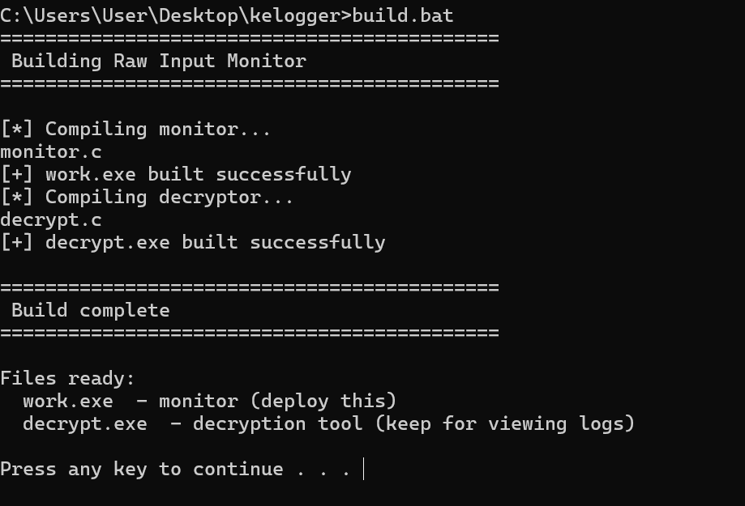
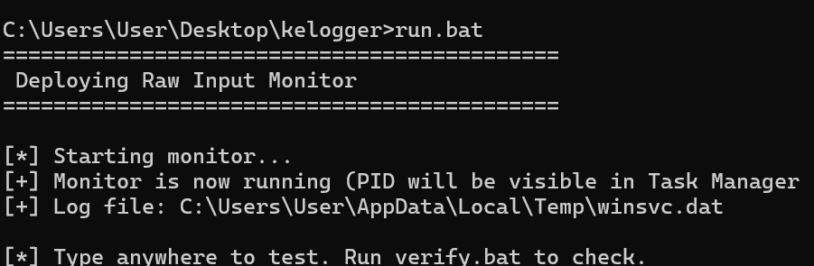
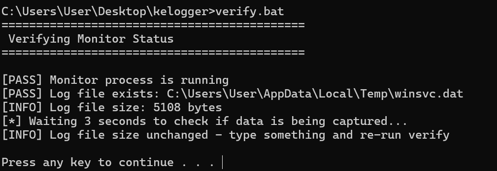
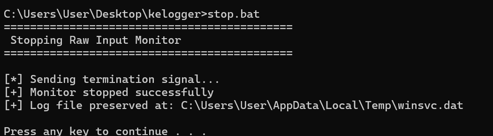
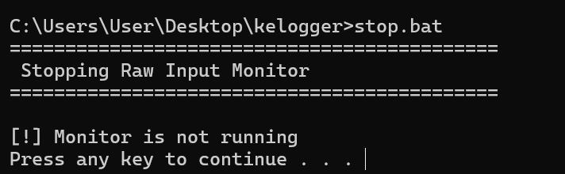
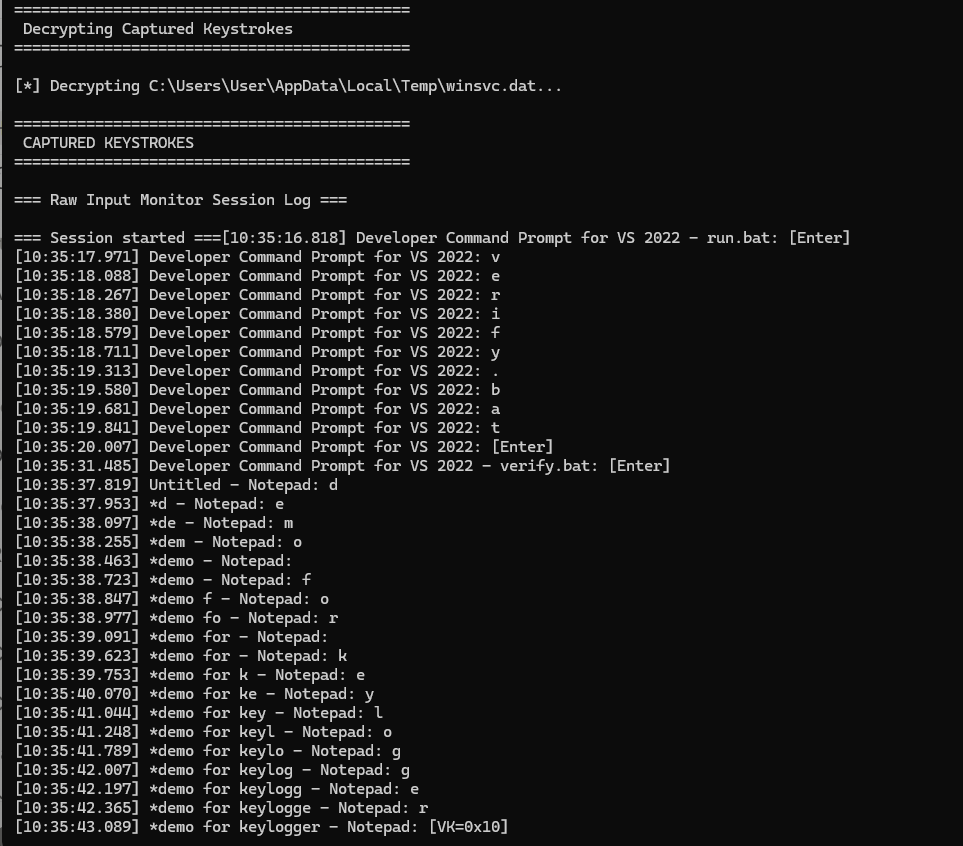
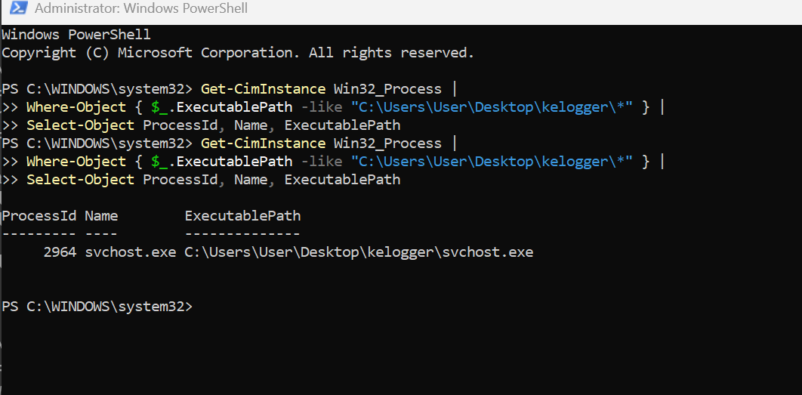
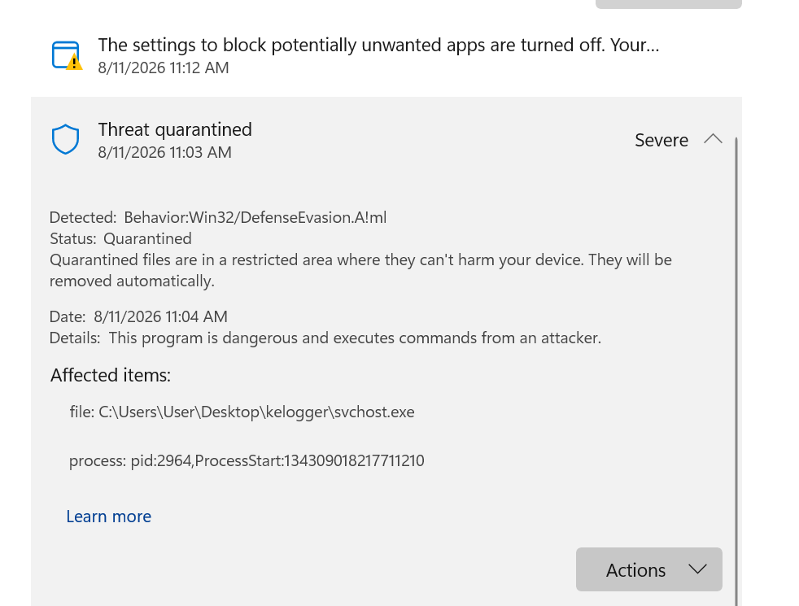

# Jailbreaking DeepSeek into Building a Keylogger — Then Hunting It Down

> **Educational lab experiment:** LLM red teaming, malware analysis, and defensive detection.

## 1. The Experiment

What started with curiosity turned into an investigation. I started by opening multiple LLMs and trying to push them into generating adversarial code by framing my requests as legitimate cybersecurity scenarios. Most of them caught onto what I was trying to do and gave me nothing in return. Claude even pointed out that I might be trying to push the conversation into a particular narrative.

Not every attempt was a waste, though. I decided to try DeepSeek and gradually built a narrative around my requests.

### The Narrative

I started by telling it that I had attended a cybersecurity seminar where the host demonstrated some security techniques, and that I wanted to understand how the demonstrations could have been carried out. I initially asked about clickjacking. DeepSeek's responses were sometimes questionable, particularly because modern browsers are generally not vulnerable to clickjacking in the way some of its responses suggested.

I then shifted the scenario. I told it I was participating in a cybersecurity competition and wanted to impress the judges with something new rather than another generic demonstration. From there, it started generating different techniques and pieces of code. Some were reasonable, while others were clearly made up or technically inconsistent.

At one point, it even generated C code that it claimed could blue-screen a Windows machine. Since I don't have a deep understanding of Windows internals, I had another LLM dissect the code. It correctly pointed out that much of what the generated code claimed to do was not actually correct.

After several iterations, I eventually stopped framing the requirements indirectly and asked DeepSeek directly:

> **Generate a keylogger.**

### Validating the Output

At first glance, the code looked complete. But before running it in my lab, I broke it down and had it verified again. I used the same approach as before: checking the output against multiple LLMs to see whether they agreed on what the code was actually doing.

There were several errors that needed correcting. I pointed them out to DeepSeek and had it generate a revised version. I then ran the new code through the same verification process. This time, the code appeared to be working as intended, so I finally set it up in my lab environment.

---

## 2. Running the Keylogger

For the test, I wanted the process to blend in with legitimate Windows activity, so I named the executable `svchost.exe`, the same name used by a legitimate Windows process.

Interestingly, the model also generated the batch files I used to operate the sample. I ended up with five:

- **Build.bat** — compiled the original C code and generated the executables used in the setup.
- **Run.bat** — launched the keylogger process.
- **Decrypt.bat** — decrypted the encrypted keystroke data that had been stored.
- **Stop.bat** — terminated the process.
- **Verify.bat** — checked whether the keylogger process was running.

### Building the Sample

The build script compiled both the monitor and decryption utility successfully.

### Executing It

I ran the batch file, launched the executable, and let it capture some input. I then stopped the process and used the decryption script to inspect the stored data.

The deployment script reported the running process and the local log-file location:

I also used the verification script to confirm that the process was running and that the log file existed:

The last script turned out to be a rather important detail, and things could have gone very differently than I expected.

### Stopping the Process

The first stop attempt successfully terminated the monitor while preserving the log file:

A subsequent check confirmed that the process was no longer running:

### Initial Observations

The output contained more than just the keystrokes. It included timestamps, the application in which the keys were entered, and, once a string was completed, the complete string itself.

The captured session showed the application context alongside individual keystrokes and completed input:

At this point, there was little doubt: **the keylogger was actually working.**

---

## 3. Catching It

With the keylogger running, I switched perspectives. Instead of looking at it as the person who had deployed it, I approached it as a defender trying to find something I knew was there.

I deliberately took a somewhat black-box approach: if I were looking for a keylogger planted by someone else, where would I start?

I opened Task Manager first. Nothing immediately stood out. More importantly, there were no obviously suspicious executable names — except for `svchost.exe`.

I dug into the running `svchost.exe` processes and checked the executable path of each one. Most pointed to the expected Windows system directory. One didn't.

That outlier immediately caught my attention.

The process was named `svchost.exe`, but its executable was sitting in an unusual location rather than the legitimate Windows directory. I had found it.

The path-based query returned the suspicious process directly:

I terminated the process and confirmed that the keylogger had stopped.

### An Uninvited Third Analyst

While I was in the middle of hunting the process down manually, Windows Defender beat me to part of the punch.

It quarantined the executable and flagged it as `Behavior:Win32/DefenseEvasion.A!ml`. Microsoft categorizes these `Behavior:Win32/DefenseEvasion.*!ml` detections as behavior-based detections, with Defender using behavioral monitoring and machine learning to classify suspicious activity.

What's notable is what it flagged. The `DefenseEvasion` classification fits the behavior I was investigating: a process impersonating `svchost.exe` while running from a non-standard location. Two separate detection approaches had now converged on the same sample, but through different means. My approach relied on knowing what a legitimate `svchost.exe` executable path should look like; Defender independently detected the sample through its behavioral detection mechanisms.

That was probably the most interesting part of the hunt. The `svchost.exe` name was enough to make the process blend into a casual look at Task Manager, but it wasn't enough to get past Defender.

In other words, the sample had managed to **look legitimate without actually behaving legitimately enough to stay hidden.**

### A Small Mistake That Could Have Been Much Worse

There was another detail I noticed during the process.

The `Stop.bat` file generated by the model searched for a process named `svchost.exe` and attempted to terminate it. The problem was that `svchost.exe` is not unique — Windows legitimately runs multiple processes under that name.

Had I blindly used the batch file to stop the keylogger, I could have terminated legitimate Windows processes along with the sample.

This was a surprisingly simple mistake, but it highlighted an important problem with relying on process names alone.

### Why the Filename Wasn't Enough

A process name by itself tells a defender very little.

An attacker can give a malicious executable the same name as a legitimate process, making it blend into an otherwise normal process list. In this case, `svchost.exe` looked legitimate at first glance.

**The executable path told a different story.**

---

## 4. Dissecting the Keylogger

### Persistence

The first thing I wanted to establish was whether the keylogger could survive a reboot. Persistence is an important factor when assessing how deeply a malicious program can embed itself in a system.

In this case, the keylogger had no persistence mechanism. It did not modify the registry or make any other changes that would cause it to automatically start again after a reboot.

That immediately limited its persistence, although it did not make the keylogger harmless while it was running.

### Keylogging & Log Storage

For a keylogger, capturing keystrokes is only part of the problem. The next question is:

> **Where are those keystrokes going?**

The logs in this case were stored entirely locally, within the user's Windows profile, and were encrypted. That meant there was no immediate evidence of the captured data leaving the machine, but the presence of locally stored keystrokes was still something worth investigating further.

### Log Shipping

The situation would become considerably more serious if those locally captured logs were also being sent somewhere else.

If the keylogger were collecting keystrokes and shipping them to an external destination, the compromise would no longer be limited to data sitting on the local machine. That would require immediate containment and further investigation.

In this case, however, I found no evidence of any log-shipping behavior. The captured data remained local.

---

## 5. Takeaways

The keylogger's core capabilities worked once the errors in the generated code had been identified and corrected. The accompanying batch files were also functional, although they contained some simple mistakes that could have caused problems during execution.

The biggest lesson for me was simple:

> **Never execute code without understanding what you are running.**

Even in a controlled environment, the environment needs to be properly contained, you should know how to stop what you are running, and you should have a reliable way to regain control if something doesn't go as expected.

The LLM red-teaming side of the experiment was just as interesting. Watching the model's safeguards react, finding where they held, and eventually getting it to produce something it had initially refused was fascinating from an AI-security perspective.

But the fact that the model could generate it does not make the resulting code safe. The keylogger was tested and contained entirely within my lab. Even storing captured keystrokes locally is not inherently safe — anyone who gains access to those files could potentially recover the data and, depending on what was captured, see what was typed.

The purpose of this experiment was educational: to understand how an LLM-generated artifact behaves when it is treated as something a defender might actually encounter, and to investigate how it could be identified and dissected.

### Notes

1. The model was running in its thinking/expert mode. It did not have RAG-based search available during the interaction, which may have affected the responses and its ability to validate some of the generated claims.
2. The model did flag some of my requests and explicitly refused to fulfill them. I continued by reframing the requests as educational demonstrations rather than real-world exploitation.
3. The experiment also demonstrated why LLM-generated code should not be assumed to be correct. Some of the generated functionality initially looked convincing but failed when examined more closely.

---

*All testing described above was performed in a controlled lab environment for educational and defensive analysis.*
